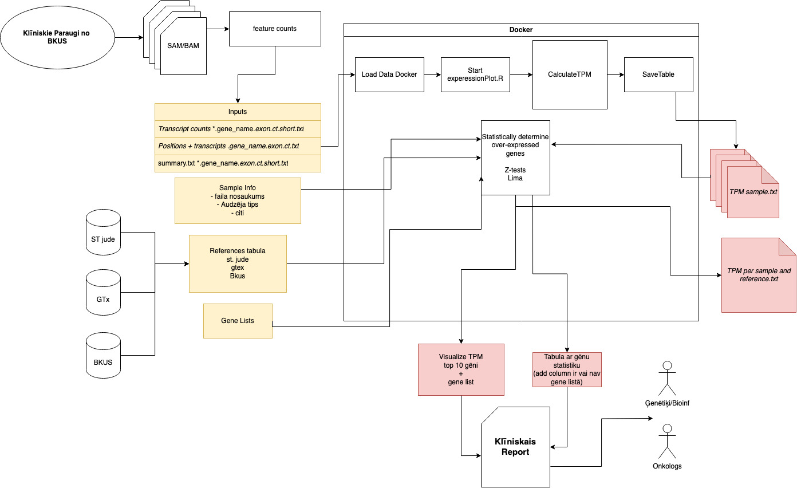

# Prevengs

Pediatric oncogenomics data analysis pipeline for RTU Innovation Health Hub med tech development program.

THIS IS A DEVELOPMENT VERSION OF THE PIPELINE. IT IS NOT READY FOR PRODUCTION USE.

## Description

dependencies list.

- Docker.

Input Files:

- Sample Counts
- Reference Lengths

Output:

- Sample Reference table
- PCA
- Top10 genes plot.
- TPM list if calculated.
- QQplots.

## About The Project

## Getting Started

add dependencies to python dependency list to requirements.txt

add dependencies to R library install code to requirements.R which is executed while image is built.

### Build the docker image

From prevengs project.

```sh
docker build -t prevengs .
```

### Get Human Release 31 (GRCh38.p12) reference gene anotations

``` bash 
wget https://ftp.ebi.ac.uk/pub/databases/gencode/Gencode_human/release_31/gencode.v31.basic.annotation.gtf.gz 
```


### Run docker image with full pipeline

Run the R pipeline script through the docker image.

```sh
# Usage: Rscript pipeline.R <input_directory> <output_folder>

docker run -v "$PWD":/usr/src/app -it --rm prevengs Rscript src/pipeline.R data/ data/gencode.v31.chr_patch_hapl_scaff.annotation.gtf ./rez
```

Change **$PWD** to directory path with HTseqfiles and scripts. Local directory is mounted to the docker container at /usr/src/app.  
This needed to access the files from the docker container.

Currently the pipeline script needs to mounted as well.

### Run the python script through the docker image  

```bash
# Process transcriptome featureCounts.

# positional arguments:
#   counts_file  The featureCounts file to process.
#   gtf_file     The GTF file to use for gene length calculation.

# options:
#   -h, --help   show this help message and exit

docker run -v "$PWD":/usr/src/app -it --rm prevengs python3 src/script.py 'data/RNS_FLT3_156.F.fastq.genome.htseq_counts.txt' 'data/gencode.v31.chr_patch_hapl_scaff.annotation.gtf'
```

### Run the R script through the docker image

Run the R top5_boxplot script through the docker image.

```sh

docker run -v "$PWD":/usr/src/app -it --rm prevengs Rscript src/top5_boxplot.R data/ ./
```

Run the R PCA script through the docker image.

Usage: Rscript PCA_for_all_genes.R <input_directory> <output_file>

```sh
docker run -v "$PWD":/usr/src/app -it --rm prevengs Rscript src/PCA_for_all_genes.R data/ ./
```


Run docker container in interactive mode

```sh
docker run -v "$PWD":/usr/src/app -it --rm prevengs
```

This code processes transcriptome data and generates a plot of the results.
The output plot shows the expression levels of different genes.


## TODO

## Authors

- Edgars Liepa
- Ņikita Fomins
- Pauls Daugulis
- Agate Jarmakovica
- Aivija Stugle
